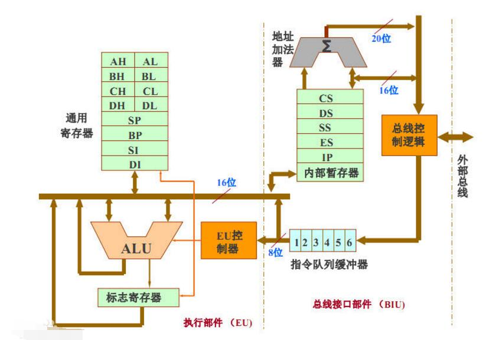

# 基础知识
##  1.什么是机器语言

CPU微处理器是控制其他芯片，器件，设备的核心部件。汇编主要操作的电子器件就是CPU.通过CPU简介操作芯片组.通过芯片组操作内存,硬盘,网卡,显卡等其他设备

机器语言：每一种微处理器，由于硬件设计和内部结构的不同，就需要用不同的电平脉冲来控制，使它工作。所以每一种微处理器都有自己的机器指令集，这就是机器语言。

ARM

AMD

Intel

## 2.什么是汇编语言

机器语言难以操作，人类无法辨别和记忆。汇编语言通过**汇编编译器**将汇编语言指令转变为机器码。计算机最终执行。

开源的汇编编译器为NASM

## 3.汇编语言组成

1. 汇编指令：机器码的助记符，有对应的机器码
2. 伪指令：没有对应的机器码，由编译器执行，计算机并不执行。
3. 其他符号：如+，-，*，/ 等，由编译器识别，没有对应机器码

汇编语言的核心是汇编指令，它决定了汇编语言的特性。**只有汇编指令有对应的机器码!**

## 4.储存器

指令和数据是应用上的概念，在磁盘或者内存中，没有区别，都是二进制数据。

寄存器是CPU中可以存储数据的器件. 一级缓存,二级缓存,三级缓存在CPU中,三级可能根据制造工艺不同位置不同.

假设一个存储器有128个存储单元，它就可以存储128个Byte。

## 5.CPU如何对存储器进行读写

CPU必须和外部器件（标准说法是芯片）进行下面3类信息的交互：

1. **存储单元的地址（地址信息）**
2. **器件的选择，读或写的命令（控制信息）**
3. **读或写的数据（数据信息）**

## 6.什么是总线？

计算机中专门连接CPU和其他芯片的导线叫总线，总线从物理上来讲，就是一根根导线的集合。

总线又分为三类：地址总线，控制总线，数据总线

地址总线：地址总线上能传送多少个不同的信息，就可以对多少个存储单元进行寻址。一个CPU有N根地址总线，可以说这个CPU的地址总线的宽度为N。地址总线的宽度决定了存储地址的大小。

例如：10根地址总线就可以寻址2的10次方的地址

数据总线：CPU与内存和其他期间之间的数据传送是通过数据总线来进行的。数据总线的宽度决定了CPU和外界的数据传送速度。例如8根数据总线可以一次性传送8位二进制数据（即一个字节）。16根地址总线一次可以传送两个字节。16进制的 二进制表示中， 2个FF才代表一个字节。

8088 数据总线宽度8   8086数据总线宽度16

答案: A

需要寻址 2的20次方个地址单元，每个单元1个字节   0XFFFFF  =  1048  ,575

 2的20次    =  0xFFFFF    =  1111 1111  1111 1111 1111   2个FF才是一个字节

可以寻址2的20次方个字节

2的20次方除以(256乘以1024)    = 4 

控制总线：CPU对外部器件的控制是通过控制总线来进行的。有多少跟控制总线，就意味着CPU提供了对外部器件的多少种控制。所以，控制总线的宽度决定了CPU对外器件的控制能力。操作的类型的多少。

内存的读写是通过多根控制总线综合发出的，其中有一根叫“读信号输出”和一根“写信号输出”的控制线负责由CPU向外传送读信号或者负责传送写信号。

主板上承载CPU，存储器，外围芯片组，扩展插槽。扩展插槽上一般插有RAM内存条和各类接口卡。

接口卡：CPU对外部设备都不能直接控制，直接控制的是这些设备在主板上对应的扩展接口卡CPU通过总线向接口卡发送命令，接口卡根据CPU的命令控制外设进行工作。

储存器芯片？

存储器芯片物理上是独立的。从读写属性上看分为两类：随机存储器RAM和只读存储器ROM

RAM随机存储器：可读可写，必须带电存储。

ROM只读存储器：只读存储器只能读取，不能写入。关机后其中的内存不丢失。

随机存储器：用于存储CPU使用的绝大部分程序和数据。主随机存储器：主板上的RAM和扩展插槽的RAM

装有BIOS的ROM：BIOS是由主板和各类接口卡厂商提供的软件系统，可以利用该硬件设备进行最基本的输入输出。例如：网卡装有的BIOS可以存储网卡的BIOS。主板的一般存的是系统的BIOS。内存条的BIOS是SPD。

接口卡上RAM:某些接口卡需要对大批量输入输出数据进行暂时存储。在其上装有RAM。最典型的是显卡上RAM。

网卡的bios  BOOTROM

https://blog.csdn.net/evenness/article/details/7751992

大型交换机有自己的处理器架构设计

上面所说的所有存储器在物理上是独立的，但是它们都是和CPU的总线相连，CPU对它们进行读写的时候，都是通过控制总线来发出内存读写命令。

从上图可以看出来逻辑地址中，不止用于主存的访问，还需要留出一些地址给其他的设备使用，方便CPU调用

所有的物理存储器被看作一个由若干存储单元组成的逻辑存储器。每个物理存储器在这个逻辑存储器中占有一个地址段，即一段地址空间，CPU在这段地址空间中读写数据，实际上就是在响应的物理存储器上读写数据。

我们可以假设如下地址分配

对CPU来讲，系统的所有存储器中的存储单元都处于一个统一的逻辑存储器中，它的容量受CPU寻址能力的限制。这个逻辑存储器即是我们所说的内存地址空间。

8086CPU的地址总线宽度是20，可以传送2的20次方个不同的地址信息。即可以定位2的20次方个内存单元，则8086PC的内存地址空间大小为1MB

80386的地址总线为32，内存地址空间最大是4GB

# 8086/8088的功能结构

8086和8088CPU按功能可分为两个独立的部分：总线接口单元BIU(Bus Interface Unit)和执行单元EU(Execution Unit)

BIU:

1. 完成CPU与存储器之间的信息传送
2. 总线控制
3. IO数据传送
4. 逻辑地址与物理地址进行转换
5. 从存储器中取指令送至指令流队列排队
6. 取出执行指令时所需要的操作数，并传送给EU完成运算和操作

EU

1. 对来自指令流队列中的指令译码并执行，实施算术逻辑运算操作。

BIU和EU是两个独立的部件，两个可以同时独立进行操作，形成指令流水线结构。

1. 
    特点： 将CPU分为两个单元，可以使取指令和执行指令同时进行，减少了 
2. ​        CPU为取指令而等待的时间，从而提高了CPU的利用率，提高了系统 
3. ​        的运行速度。

# 8086/8088的寄存器结构

## 数据寄存器

共有4个16位寄存器即AX,BX,CX,DX，通常用来暂存计算过程中的操作数，运算结果或者其他信息。它们既可以当做一个16位寄存器使用，也可以分成两个8位寄存器来使用，高8位分别为AH,BH,CH,DH，底8位分别为AL,BL,CL,DL

1. **AX（accumulator）**：累加器，它是算术运算的主要寄存器，此外还可以作为乘，除运算及输入，输出的专用寄存器。
2. **BX（Base）**：基址寄存器，常用于存放存储区的起始地址。  每次增加他的地址，来获取循环中需要操作的参数
3. **CX（Count）**：计数寄存器，常用于循环操作或字符操作中的计数器。
4. **DX（Data）**：该寄存器常与AX配合，用于双字长运算，DX存放高位字，AX存放底字位，此外还可以用于输入、输出指令中存放外部设备接口的端口地址。

## 段寄存器

存放正在或正待执行的各个段的段首址，其值为相应段的段值

1. **CS（Code Segment）**：代码段寄存器
2. **DS（Data Segment）**：数据段寄存器
3. **ES（Extra Segment）**：附加段寄存器
4. **SS（Stack Segment）**：堆栈段寄存器

通常CS划定并控制当前程序区，DS和ES划定并控制数据区，SS划定并控制堆栈区。

# 指针寄存器和变址寄存器

指针寄存器和变址寄存器共有4个16位寄存器，即SP，BP，SI，DI，主要用于在访问存储器单元时提供16位偏移地址

1. **SP（Stack Pointer）**：堆栈指针寄存器，主要用于存放当前堆栈段的段内偏移地址，即栈顶地址。与SS连用可以访问堆栈中的任意一个存储单元。
2. **BP（Base Pointer）**：基址指针寄存器，主要用于提供栈内某个单元的偏移地址，与SS连用可以访问堆栈中的任意一个存储单元。
3. **SI（Source Index）**：源变址寄存器，在串操作指令中，SI作为隐含的源变址寄存器与DS联用，以确定数据段中存储单元地址，然后根据DF标志，SI进行自动增量或自动减量。
4. **DI（Destination Index）**：目的变址寄存器，在串操作指令中，DI作为隐含的目的变址寄存器与ES联用，以达到在附加段中寻址的目的，然后根据DF标志，DI进行自动增量和自动减量。

**串操作指令**也叫串指令：是指在内存中执行数据串操作的指令。
而数据串是指在内存中连续存放的若干字节或字。字节组成的叫字节串，字组成的叫字串。
数据串的概念类似于高级语言中的数组的意思。

# 控制寄存器

## IP寄存器

**IP（Instruction Pointer）**：指令指针寄存器，用来存放代码段中指令的偏移地址。在程序运行中，IP与CS联用，以确定下一条指令的物理地址。该寄存器作为专用寄存器，一般不能用来存放其他数据

**FR（Flag Register）**：标志寄存器，主要用于反应处理器的状态和运算结果的某些特征，包含9个标志，6个是条件码标志位，3个值控制标志位。

**段地址SA**

**偏移地址EA**

SAx16+EA = 物理地址

# 存储器结构与堆栈

## 存储器结构

**在存储器中，信息是以字节(8个二进制位)为最小存储单位，每一个字节单元分配一个唯一的存储器地址。**8088/8086CPU有20根地址线，地址从00000H开始到0FFFFFH结束。地址用无符号二进制表示。但为了便于书写，用16进制表示。0FFFFFH   1111  1111  1111  1111  1111    8个1为一个字节   4个1可以表示为一个16进制数

**一个字数据在存储器中存于相邻的两个字单元**。数据的低字节存入低地址单元，高字节存入高字节单元。因此，按地址递增方式存储一个字数据时，应先存入低字节数据，再存入高字节数据。**在访问字单元时，一般给出的字单元地址的低地址**

要访问一个存储器单元，必须得到该存储单元的物理地址，物理地址由段地址和偏移地址合成。（由于8086/8088用于寻址的寄存器都是16位BX，BP等，而16位寄存器只能寻址64KB的地址范围；但8086/8088CPU具有20根地址线，寻址可达1MB地址范围，即00000H~0FFFFFH之间寻址。）20根总线扩充了逻辑地址范围。逻辑地址左移4个2进制位，来获取物理地址

1. **物理地址（PA ： physical address）**是由8086/8088的地址引线送出的20位地址码。如果8086/8088要访问存储器的任意单元，则需要提供20位的二进制数给地址总线，才能访问。
2. **段首址（SB：segment base）**是存储器中的每一段的起始地址，又称为基地址。
3. **偏移地址（EA ：effective address）**是相对于某段首地址的段内偏移量，用16位二进制代码表示，写成4位16进制数。
4. **逻辑地址（LA ：logical address）**是程序中对存储器地址的一种表示方法，由某段的段首址和段内偏移地址表示。一般写成"段首址：偏移地址"，如0B47H：0080H。

存储器地址分段：从0地址开始，把1MB的存储器分成若干段，16字节为一小段，段的起始地址必须从任一小段的首地址开始，也就是说，当一个段开始的物理地址表示成20位的二进制地址码时，最低4位是0。

每段的最小容量是16B，最大为64KB，这样段内地址就可以用16位来表示。实际上，可以根据编程的需要来确定段的大小，它可以是64KB范围内的任意多个字节。

**存储器分段后，每个段的首地址保存在8088/8086内部的CS，DS，SS，ES这四个16位寄存器中，可以对段寄存器设置不同的值，指向不同的段。**

**物理地址=段首址×16D+偏移地址**等价于**物理地址=段首址×10H+偏移地址**（在段首址后面加个0在与偏移地址相加）

**0ABCDH:0234H:**
0ABCDH×16D+0234H=ABCD0H+0234H=0ABE04H

BIU组成

指令队列缓冲器

当EU正在执行指令时，且不占用总线时，BIU会自动的进行预取指令操作，将所取得的指令按先后次序存入指令队列缓冲器

